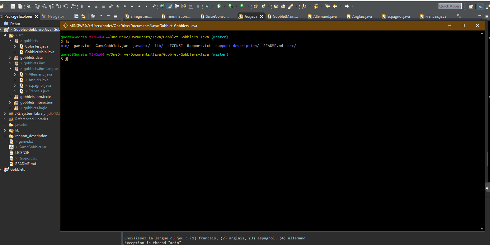

# Gobblet-Gobblers-Java
Gobblet Gobblers is a strategy game similar to tic-tac-toe but more complex and interesting.

### Usage
open the folder Gobblet-Gobblers-Java in cmd
clear
java -jar GameGobblet.jar

### Example

### To compile
You will need Jansi library : https://github.com/fusesource/jansi
in order to see the color in the command line.

Disclaimer, if you use Eclipse download this plug-in to see the colors in the command line :
http://mihai-nita.net/2013/06/03/eclipse-plugin-ansi-in-console/